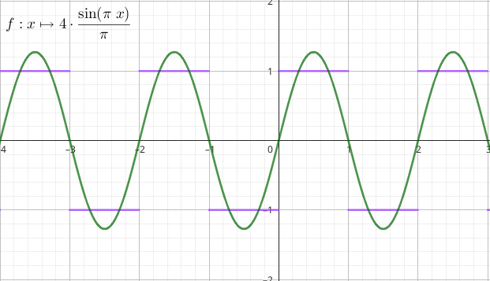
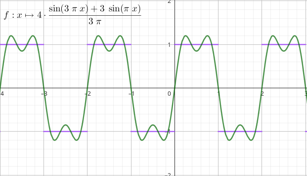
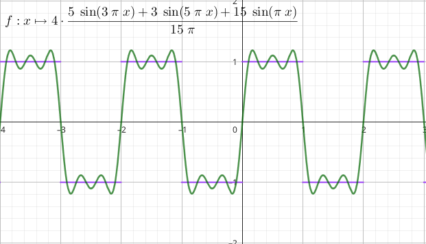

# Propagation d'un signal
> En physique, un signal $s$ est une modification d'une propriété physique en un
> point donné de l'espace. Cette perturbation est transportée dans l'espace au
> cours du temps sous la forme d'une onde.

Une tension, un son ou un rayon lumineux sont ainsi des signaux.

> Une onde est une modification des propriétés physiques d'un milieu matériel ou
> immatériel engendrée par une action locale et qui se propage d'un point à
> l'autre à une vitesse finie.

> La vitesse de propagation d'un signal est appelée célérité de l'onde.

Phénomène                       | Signal                                       | Milieu de propagation
---                             | ---                                          | ---
Ronds dans l'eau                | Déformation rationnelle de la surface        | Eau
Ondes élastiques dans un solide | Déformation du matériau                      | Solide
Ondes acoustiques               | Variation de pression des couches d'air      | Air, liquide, solide
Ondes électromagnétiques        | Champ électromagnétique                      | Vide ou milieu transparent
Ondes gravitationnelles         | Oscillation de la courbure de l'espace-temps | Vide intersidéral
> Une onde est dite transverse si elle est provoquée par une perturbation
> perpendiculaire à sa direction de propagation.

C'est le cas des ondes à la surface de l'eau et des ondes électromagnétiques.

> Une onde est dite longitudinale si elle est provoquée par une perturbation
> parallèle à sa direction de propagation.

C'est le cas des ondes acoustiques. Les ondes sismiques peuvent être l'une ou
l'autre des deux classes.

> Une onde est dite mécanique si elle a besoin d'un milieu matériel pour se
> propager.

Les ondes acoustiques ou les ronds dans l'eau sont des ondes mécaniques.

## Ondes progressives unidimensionnelles
### Définitions
> Une onde progressive est une onde qui se propage de proche en proche sans
> déformation.

> Une onde unidimensionnelle ne se propage que dans une seule direction spatiale
> $x$.

| Ondes                                 | Valeur de célérité                           |
|---------------------------------------|----------------------------------------------|
| Ondes électromagnétiques dans le vide | $C = 3.0 \times 10^8 m \cdot s^{-1}$         |
| Son dans l'air                        | $C_\text{son} \approx 340 m \cdot s^{-1}$    |
| Son dans l'eau                        | $C_\text{son} \approx 1500 m \cdot s^{-1}$   |
| Son dans l'acier                      | $C_\text{acier} \approx 5000 m \cdot s^{-1}$ |

### Description mathématique de la propagation
Une onde progressive unidimensionnelle est décrite sous la forme d'une fonction
de deux variables, l'espace et le temps. Elle est notée $s(x,t)$.

### Représentation spatiale
On représentera dans ce cas l'onde pour tout $x$, à un $t$ fixé.
À $t = 0$, on représente $s(x,0)$ avec la perturbation originale.
À $t > 0$, on représente cette même perturbation, décalée de $c \times t$
(la célérité de l'onde par le temps passé) (puisque l'onde est progressive).
On a donc $s(x,t) = s(x - ct, 0)$.

On peut visualiser cette représentation comme une chronophotographie de l'onde à
différents instants choisis particulièrement.

### Représentation temporelle
Pour tout $t$ à x fixé, on représente la perturbation.
Ainsi, à $x > 0$, on a l'onde décalée de $\frac{x}{c}$, donnant
$s(x,t) = s(0, t - \frac{x}{c})$

### Bilan
Soit une onde progressive unidimensionnelle, on peut poser :
- $s(x,t) = f(x - ct) = F(t - \frac{x}{c})$ dans le sens croissant de x
- $s(x,t) = g(x + ct) = G(t + \frac{x}{c})$ dans le sens décroissant de x

## Onde progressive sinusoïdale
### Définition
Une onde progressive est dite sinusoïdale si elle est définie telle que
$s(x,t) = S_n \cos(\omega(t \pm \frac{x}{c}) + \Phi)$, où $S_n$ est l'amplitude
de l'onde (de la dimension de l'onde) et $\omega$ est sa pulsation $[T^{-1}]$.

### Principe de superposition et théorème de Fourier
> Dans un milieu linéaire, les signaux de deux ondes arrivant au même point
> s'ajoutent.

> Si la perturbation qui engendre l'onde est $T$-périodique, alors
> $F(t \pm \frac{x}{c})$ est $T$-périodique.

> On peut décomposer un signal sous la forme d'une série de fonctions sinusoïdales :
> $s(t) = <s> + \sum\limits_{n = 1}^{+\infty} A_n \cos(n \omega t + \Phi_n)$,
> avec $\omega = \frac{2 \pi}{T}$, $A_n \in \mathbb{R}$ le spectre des amplitudes
> de $s(t)$ et $\Phi_n \in [-\pi,\pi]$ le spectre de phase de $s(t)$. Les
> fonctions $H_n(t) = A_n \cos(n \omega t + \varphi)$ sont les harmoniques de $s(t)$.

Par exemple, pour une onde en créneaux de période $T$ et d'amplitude $E_0$, on a
$s(t) = \frac{E_0}{2} + \sum\limits_{n = 1}^{+\infty} \frac{2E_0}{n\pi} \cos(n \omega t - \frac{\pi}{2})$
$= \frac{E_0}{2} + \frac{2E_0}{\pi} \sin(\omega t) + \frac{2E_0}{3\pi} \sin(3\omega t)\ldots$

On s'approche ainsi de plus en plus de la fonction. Plus on ajoute
d'harmoniques, plus la somme se rapproche de la fonction. On représente sous la
forme d'un spectre en amplitude l'amplitude selon l'oscillation $\omega$. Ce
traitement permet de montrer si un signal est périodique ou non, de trouver son
amplitude et sa moyenne, et de faire des conversions entre analogique et digital
et inversement (encodage du son par exemple).

_Décomposition en série de sinus de l'onde créneau, première passe_

_Décomposition en série de sinus de l'onde créneau, deuxième passe_

_Décomposition en série de sinus de l'onde créneau, troisième passe_

_Décomposition en série de sinus de l'onde créneau, dixième passe_

Pour observer la décomposition selon un nombre donné d'itérations, accédez au fichier Géogebra [decomposition.ggb](./Propagation-signal-assets/decomposition.ggb).

### Double périodicité des ondes progressives sinusoïdales
$s(x,t) = S_n \cos(\omega (t - \frac{x}{c}) + \Phi) = S_n \cos(\omega t - kx + \Phi)$

La pulsation spatiale est définie par $k = \frac{\omega}{c}$, en $m^{-1}$ or
$rad \cdot m^{-1}$.

#### Périodicité temporelle
> À $x = x_0$ fixé, $s(x_0,t)$ et périodique de période $T = \frac{2\pi}{\omega}$
> et sa fréquence $f$ est telle que
> $f = \frac{1}{T} = \frac{\omega}{2T}$, soit $\omega = 2\pi f$.

#### Périodicité spatiale
> À $t = t_0$ fixé, $s(x,t_0)$ est périodique de période spatiale
> $\lambda = k$ longueur d'onde et avec $k = \frac{2\pi}{\lambda}$.

> La fréquence spatiale ou nombre d'onde correspond à $\sigma = \frac{k}{2\pi} = \frac{1}{\lambda}$.

#### Bilan : à connaître par cœur
Dimension | Période | Fréquence | Pulsation
---|---|---|---
Temporelle | $T$ | $f$ | $\omega = \frac{2\pi}{T} = 2Tf$
Spatiale | $\lambda$ | $\sigma$ | $k = \frac{2\pi}{\lambda} = 2\pi \sigma$

Relation entre les grandeurs :
- $\lambda = c T$, respectivement en $m$, $m \cdot s^{-1}$ et $s$
- $\omega = k c$, respectivement en $rad \cdot s^{-1}$, $rad \cdot m^{-1}$ et $m \cdot s^{-1}$

## Ressources supplémentaires
### Annulation de deux ondes
Lorsque deux ondes opposées vont l'une vers l'autre, elles s'annulent (par exemple sur une corde) :
[ondes_s_annulent.webm](./Propagation-signal-assets/ondes_s_annulent.webm)
Vous pouvez animer cette vidéo dans le fichier [ondes_s_annulent.ggb](./Propagation-signal-assets/ondes_s_annulent.ggb).
